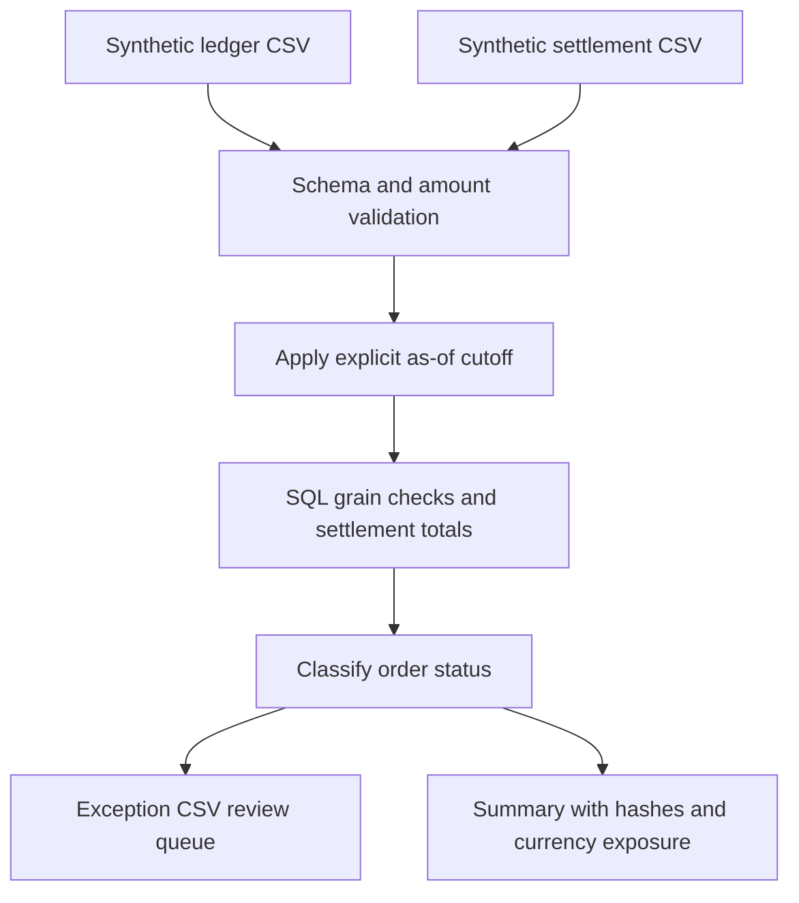

# Ledger reconciliation and data quality

**Explain why a retail ledger and payment settlements disagree, without mixing currencies or double-counting duplicates.**

An operations analyst needs a review queue that separates pending payments from overdue missing settlements,
amount discrepancies, currency errors, duplicate records, and settlements with no ledger order. This project
uses SQL for classification and Python for explicit input contracts, reproducible reporting, and audit hashes.

**Verified locally:** 1,008 synthetic ledger rows and 1,005 settlement rows produce 1,010 reviewed order IDs,
947 matches, 10 pending orders, and **53 exceptions**. No real bank, financial-services production usage,
or employer data is represented.

## Review in 60 seconds

* [Classification SQL](sql/reconcile.sql): window functions, deduplication diagnostics, aggregates, and a complete order-key set.
* [Expected output](examples/summary.json): business cutoff, counts, hashes, and separate currency exposure.
* [Review queue](examples/exceptions.csv): order-level reasons and amounts.
* [Behavioral tests](tests/test_recon.py): split settlements, time boundaries, mixed currencies, duplicates, and empty inputs.

## Architecture



## Run

Python 3.11 or 3.12. The reconciliation command uses only the Python standard library.

```bash
python -m recon.run --cutoff 2026-09-30
python -m venv .venv
source .venv/bin/activate
python -m pip install -r requirements.txt
python -m pytest -q
```

Outputs are `artifacts/summary.json`, `artifacts/exceptions.csv`, and `artifacts/all_orders.csv`.
The cutoff is required so results never change silently with the system clock.

```bash
python -m recon.run --cutoff 2026-09-30 --grace-days 2 --tolerance-cents 0 --fail-on-exceptions
```

With the deliberately anomalous fixture, the final command writes reports and exits **2**. That is the
expected quality-gate result, not a pipeline crash. Without the flag, execution exits 0 after producing reports.
Windows users should activate `.venv\Scripts\activate`. `RECON_OUTPUT` can configure the output directory.

## Schema and matching policy

| Input | Contract |
|---|---|
| Ledger | Unique ingestion `row_id`, business `order_id`, order date, currency, expected integer cents |
| Settlements | Unique ingestion `row_id`, business `settlement_id`, order ID, settled date, currency, integer cents |
| Report | One diagnostic status per order ID, expected/settled values, record counts, and difference |

Multiple settlement IDs can pay one order in installments. Repeated settlement IDs are flagged rather than
silently declared matched. Repeated ledger order IDs are also flagged. Row IDs are unique ingestion
identifiers; duplicates in those identifiers fail input validation.

Both sides exclude records dated after the cutoff. An unpaid order whose age is at most the configured
grace period is pending; older unpaid orders are missing settlements. Different currencies are never compared
as equivalent cents, and their `difference_cents` is null. Exposure totals are grouped by currency and exclude
ambiguous duplicate and currency-error orders.

Representative classification:

```sql
WHEN p.order_id IS NULL
 AND julianday(:cutoff) - julianday(l.order_date) <= :grace_days THEN 'pending'
WHEN p.order_id IS NULL THEN 'missing_settlement'
WHEN ABS(l.amount_cents - p.settled_cents) > :tolerance_cents THEN 'amount_mismatch'
```

See [matching decisions](docs/decisions.md) for precedence and the difference between a diagnostic row and
an authoritative accounting adjustment.

## Verified result

| Status | Orders |
|---|---:|
| Matched | 947 |
| Pending | 10 |
| Missing settlement | 10 |
| Amount mismatch | 10 |
| Currency mismatch | 10 |
| Duplicate ledger | 8 |
| Duplicate settlement | 5 |
| Unexpected settlement | 10 |

The unambiguous net USD difference is **24,900 cents** for this synthetic fixture. This is a test result,
not recovered money or a business savings claim. Input hashes allow reviewers to trace exactly which
files produced the report. [Verification](examples/verification.txt) records the local tests.

## Limits and next steps

This models one expected ledger amount per order. Refunds, chargebacks, processor fees, FX conversion,
and changing historical ledger expectations are out of scope. It uses SQLite-specific date functions and
an in-memory database; PostgreSQL migration is not claimed. CSV inputs are parsed in memory.

Each order receives one primary status; several problems can coexist. Duplicate amounts shown in the
review queue are diagnostic, not trusted settlement totals. Next steps: emit all applicable reason codes,
add fee/refund contracts, and implement a PostgreSQL integration with the same business-rule tests.

Code: MIT. Synthetic data: CC0 1.0. See [provenance](data/README.md) and [attribution](ATTRIBUTION.md).
